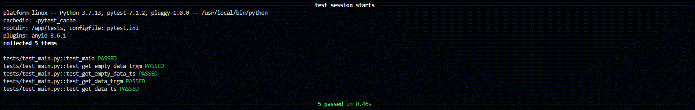

# Turkish Movie Search Engine using PostgreSQL 🔎

<br>

<p style="text-align:center">
 
 


</p>
<br>
<br> 

<p>
<p style="text-align:center">
Full Text Search
 
<br>
Trigrams
 
</p>

This is PostgreSQL version of [Turkish Movie Search Engine](https://github.com/silverstone1903/autocomplete-search-fastapi-es-kibana). Code contains a template for using FastAPI backend with PostgreSQL for text search. There are two search methods:
1. Full Text Search using [TS Vectors](https://www.postgresql.org/docs/current/datatype-textsearch.html#DATATYPE-TSVECTOR) (`/fts` endpoint)
2. Full Text Search using [Trigrams](https://www.postgresql.org/docs/current/pgtrgm.html) (`/trgm` endpoint)

Data source: [Turkish Movie Sentiment Analysis Dataset](https://www.kaggle.com/mustfkeskin/turkish-movie-sentiment-analysis-dataset)
* I just selected unique movie names.

## Installation

There are only two prerequisites:

* [Docker](https://docs.docker.com/get-docker/)
* [Docker-compose](https://docs.docker.com/compose/install/)

<br>

``` bash
git clone https://github.com/silverstone1903/autocomplete-search-fastapi-postgresql-fts.git
```

## Usage
### Start 

``` bash
docker-compose up -d
```

If you make any changes you can add `--build`. 

``` bash
docker-compose up --build -d
``` 

### Stopping containers

``` bash
docker-compose down
```
### Container Logs
When running containers with detached mode (`-d`) they work in the background thus you can't see the flowing logs. If you want to check compose logs with cli you can use `logs`.

``` bash
docker-compose logs --tail 50
```

* FastAPI (UI): http://localhost:8000

# Tests

If you want to run the tests inside the container;

```bash
docker-compose exec web pytest tests -sv
```

Test results 👇🏻

<p>
<p style="text-align:center">
 
</p>

Resources Tests
* [How to use fuzzy string matching with Postgresql](https://www.freecodecamp.org/news/fuzzy-string-matching-with-postgresql/)
* [Postgres Full-Text Search: A Search Engine in a Database](https://www.crunchydata.com/blog/postgres-full-text-search-a-search-engine-in-a-database)